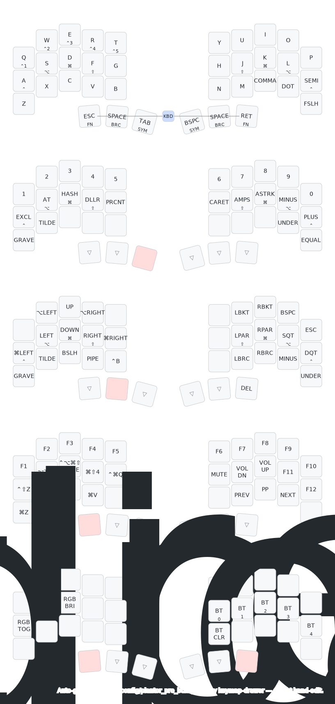

# Piantor Pro BT — ZMK config

ZMK firmware config for a 36-key **Piantor Pro BT** split keyboard (macOS modifiers, ZMK v0.3). Five layers, all reached from the thumb cluster.

> Auto-generated from [`config/piantor_pro_bt.keymap`](config/piantor_pro_bt.keymap)
> by [keymap-drawer](https://github.com/caksoylar/keymap-drawer) on every push
> (see [`.github/workflows/draw-keymap.yml`](.github/workflows/draw-keymap.yml)).
> **Edit the keymap, not this image.** In each key the large legend is the tap and
> the small legend is the hold — a modifier (⌃ ⌥ ⌘ ⇧) or a layer name. A highlighted
> thumb marks the key whose hold activates that layer.

## Layer activation

| Layer | Hold                        |
|-------|-----------------------------|
| SYM   | tab or bspc (inner thumbs)  |
| BRC   | space (both middle thumbs)  |
| FN    | esc or enter (outer thumbs) |
| KBD   | esc **and** enter together  |

Home-row mods (pinky→index): Ctrl, Alt, Cmd, Shift. Top-row holds = Ctrl+1..5 (macOS desktop switch).

## Notes

- **BRC del:** hold a space thumb, then tap the right outer thumb → del. (BRC remaps
  that thumb to del — restoring delete, which base drops when enter takes the outer thumb.)
- **Clipboard (FN):** ⌘Z/X/C/V are most comfortable held with **enter** (right thumb, opposite hand).
- **Firmware:** 42-position board with the outer pinky column unpopulated; the keymap
  pads each row with `&none` (matrix positions 0, 11, 12, 23, 24, 35). The drawing trims
  that column and renders the real 36-key 3×5+3 shape.

## Build

No local toolchain — firmware builds on **GitHub Actions**. Push to `main` or open a PR,
or trigger the build manually via `workflow_dispatch`. See [CLAUDE.md](CLAUDE.md) for the
repo layout and build details.
